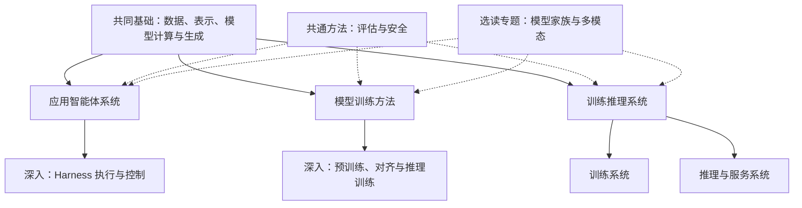
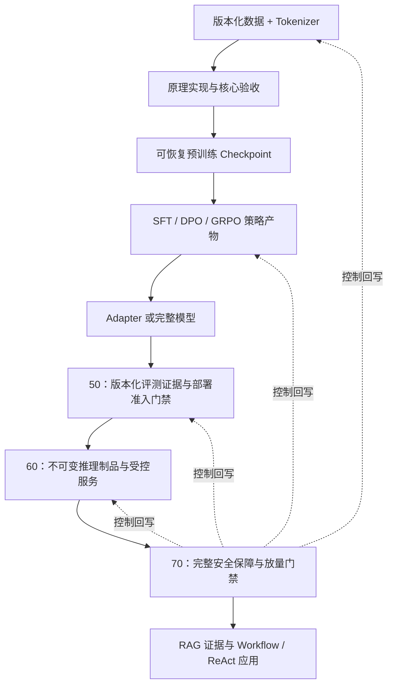

# 大模型：从原理实现到生产实践

这是一套面向已有机器学习与深度学习基本概念读者的进阶课程。课程不假设读者已经掌握大模型实现，但要求能够阅读 Python，理解张量、损失函数、梯度下降和基本神经网络。`10_foundations.ipynb` 用于快速恢复这些共同语言，不承担完整的零基础课程职责。

各章遵循同一学习路径：**先明确学习契约，再建立直觉与输入输出契约，以最小数据从零实现核心机制，通过数值或行为证据验证结果，随后迁移到 PyTorch、Transformers、Datasets、TRL、PEFT 等生产库，并明确生产边界。**

## 共同基础与三条方向

课程按学习目标组织为共同基础、应用智能体系统、模型训练方法、训练推理系统。每条方向分别设置入门内容与深入专题；数据、评估、安全和模型家族按需要跨方向使用。教材的[阅读路线](../README.md#阅读路线)说明理论选读范围。

图中的连线表示学习关系。每个 Notebook 的学习契约列出知识与资产前置；具有等价知识的读者可直接进入相关主题。主题阅读可以分阶段，运行单元格时仍需按文件内的数据与定义依赖执行。文件前缀用于稳定定位，方向归属以本页和学习契约为准。

## 实验目录

| 顺序 | 主题 | Notebook |
|---|---|---|
| 1 | 语言模型理论基础 | [10_foundations.ipynb](10_foundations.ipynb) |
| 2 | 语言模型理论基础 | [20_dataset.ipynb](20_dataset.ipynb) |
| 3 | 语言模型理论基础 | [21_tokenizer.ipynb](21_tokenizer.ipynb) |
| 4 | 语言模型理论基础 | [30_transformer.ipynb](30_transformer.ipynb) |
| 5 | 语言模型理论基础 | [31_nlp_gpt.ipynb](31_nlp_gpt.ipynb) |
| 6 | 语言模型理论基础 | [50_model_evaluation.ipynb](50_model_evaluation.ipynb) |
| 7 | 语言模型理论基础 | [70_model_safety.ipynb](70_model_safety.ipynb) |
| 8 | 应用智能体系统 | [91_prompt_reasoning.ipynb](91_prompt_reasoning.ipynb) |
| 9 | 应用智能体系统 | [90_llm_applications.ipynb](90_llm_applications.ipynb) |
| 10 | 模型训练方法 | [40_pre_training.ipynb](40_pre_training.ipynb) |
| 11 | 模型训练方法 | [41_post_training.ipynb](41_post_training.ipynb) |
| 12 | 模型训练方法 | [42_peft.ipynb](42_peft.ipynb) |
| 13 | 模型训练方法 | [A20_data_engineering.ipynb](A20_data_engineering.ipynb) |
| 14 | 模型训练方法 | [A30_reasoning_model.ipynb](A30_reasoning_model.ipynb) |
| 15 | 训练推理系统 | [A10_resource_planning.ipynb](A10_resource_planning.ipynb) |
| 16 | 训练推理系统 | [A40_training_optimization.ipynb](A40_training_optimization.ipynb) |
| 17 | 训练推理系统 | [60_inference_deployment.ipynb](60_inference_deployment.ipynb) |
| 18 | 训练推理系统 | [A50_inference_optimization.ipynb](A50_inference_optimization.ipynb) |
| 19 | 训练推理系统 | [A60_model_compression.ipynb](A60_model_compression.ipynb) |
| 20 | 模型架构拓展 | [E30_nlp_bert.ipynb](E30_nlp_bert.ipynb) |
| 21 | 模型架构拓展 | [E10_open_model.ipynb](E10_open_model.ipynb) |
| 22 | 模型架构拓展 | [E40_cv_vit.ipynb](E40_cv_vit.ipynb) |
| 23 | 模型架构拓展 | [E20_multimodal_llm.ipynb](E20_multimodal_llm.ipynb) |
| 24 | 模型架构拓展 | [E50_cv_diffusion.ipynb](E50_cv_diffusion.ipynb) |

基础篇中的安全实验先选读威胁模型与工具授权，完整保障结合部署拓扑开展。实验目录用于主题定位，执行前核对各文件的知识与资产前置。

### 语言模型理论基础

| 顺序 | 实践 | 知识与机制 |
|---|---|---|
| 1 | [10_foundations.ipynb](10_foundations.ipynb) | 张量、损失、梯度、泛化与指标 |
| 2 | [20_dataset.ipynb](20_dataset.ipynb) | 数据模式、版本、划分与文件契约 |
| 3 | [21_tokenizer.ipynb](21_tokenizer.ipynb) | UTF-8、频次、BPE 与词元协议；前置为数据契约 |
| 4 | [30_transformer.ipynb](30_transformer.ipynb) | 矩阵运算、Attention、Mask 与 Encoder–Decoder 数据流；前置为基础与分词 |
| 5 | [31_nlp_gpt.ipynb](31_nlp_gpt.ipynb) | Decoder-only、下一词元目标与生成；前置为 Transformer |

共同理论以能够解释一次请求的输入、前向计算、输出与失败边界为终点。完整基础实验进一步包含从零实现、训练和数值验证，所需时间与资源分别见学习契约。应用方向可在具备等价模型知识后进入应用实验，训练方向需掌握梯度与训练循环。

[50_model_evaluation.ipynb](50_model_evaluation.ipynb)提供共用评估方法，使用冻结输出学习指标、数据隔离、裁判校准与统计证据；[70_model_safety.ipynb](70_model_safety.ipynb)中的威胁模型、输入信任和工具授权应提前阅读，其完整系统保障结合实际部署拓扑展开。

### 应用智能体系统

入门顺序为 `50 → 91 → 90`：

- [50_model_evaluation.ipynb](50_model_evaluation.ipynb)：先明确任务、独立评测集与比较方法。
- [91_prompt_reasoning.ipynb](91_prompt_reasoning.ipynb)：学习 ICL、提示、候选采样与策略评测，前置为 `31` 的生成机制和 `50` 的评测方法。
- [90_llm_applications.ipynb](90_llm_applications.ipynb)：以模型上线助手贯通 RAG、只读工具、固定工作流、有界 Agent 与引用验证，前置为模型调用、数据版本和评测；提前阅读 `70` 的工具授权与信任边界。

学习终点是形成可检查的检索报告、证据 Prompt、执行轨迹与失败归因。深入 Harness 时，结合教材的[智能体架构](../book/textbook/chapters/74-agent-architecture.tex)和[运行系统](../book/textbook/chapters/75-agent-runtime.tex)研究持久化、执行隔离与失败恢复。`90` 的实验范围是有界执行循环。需要发布模型服务时，衔接系统方向的 `60` 与 `70`。

### 模型训练方法

前置为数据与分词契约、自动微分、自回归损失和训练循环。训练循环与检查点知识在 `40` 中补齐；已有基座模型可用于后训练实验。

| 层次 | 实践顺序与范围 | 学习终点 |
|---|---|---|
| 入门适配 | [41_post_training.ipynb](41_post_training.ipynb) 的 SFT 数据与监督目标 → [42_peft.ipynb](42_peft.ipynb)；结合 `50` 评估 | 解释监督掩码、可训练参数、保存重载与能力退化 |
| 预训练专题 | [40_pre_training.ipynb](40_pre_training.ipynb)，前置为 `31` 与训练循环基础 | 理解下一词元训练、调度与可恢复检查点 |
| 数据工程专题 | [A20_data_engineering.ipynb](A20_data_engineering.ipynb)，前置为 `20`、`21` 与训练数据消费知识 | 建立格式适配、去重、采样、分片与数据血缘 |
| 人类反馈、偏好对齐与推理训练 | `41` 的 DPO、GRPO → [A30_reasoning_model.ipynb](A30_reasoning_model.ipynb)，补齐奖励、评估和 `91` 的测试时策略 | 区分监督、偏好与可验证奖励，检验目标收益与奖励利用 |

`41` 将 SFT、DPO 和 GRPO 放在同一文件中。入门可先阅读 SFT 主题，再学习参数高效适配；执行整个文件时需满足完整学习契约及单元格依赖。资源预算可结合 `A10`，扩大训练规模时进入 `A40`。

### 训练推理系统

先用 [A10_resource_planning.ipynb](A10_resource_planning.ipynb)建立参数、显存、工作量和期限的预算模型；前置为模型结构，训练部分补齐优化器状态，服务部分补齐并发与请求长度。估算结果需用目标设备测量校准。

| 分支 | 顺序与前置 | 学习终点 |
|---|---|---|
| 推理与服务 | `50` → [60_inference_deployment.ipynb](60_inference_deployment.ipynb) → `70` → [A50_inference_optimization.ipynb](A50_inference_optimization.ipynb)；需理解 `31` 的生成与缓存 | 区分制品、请求、调度和 Kernel，建立容量、质量与延迟的测量方案 |
| 训练系统 | 掌握 `40` 的梯度、状态与恢复 → [A40_training_optimization.ipynb](A40_training_optimization.ipynb) | 解释梯度累积、混合精度、分片、并行与通信成本 |
| 模型优化专题 | [A60_model_compression.ipynb](A60_model_compression.ipynb)；前置为 `31` 和矩阵运算，蒸馏与训练时压缩补齐 `40` | 比较量化、剪枝、低秩与蒸馏的质量及执行条件 |

推理服务与训练系统分别按所列依赖进入。`60` 的部署学习使用受控环境，完整放量与副作用能力需满足 `70` 的系统安全保障；这一交付条件随服务生命周期执行。

### 模型架构拓展

| 实践 | 前置 | 内容 |
|---|---|---|
| [E10_open_model.ipynb](E10_open_model.ipynb) | `31`，训练知识按需补齐 | 模型仓库、配置、许可证与制品审计 |
| [E30_nlp_bert.ipynb](E30_nlp_bert.ipynb) | `21`、`30` | 双向编码、MLM 与任务头 |
| [E40_cv_vit.ipynb](E40_cv_vit.ipynb) | `30` 与图像张量布局 | Patch、视觉 Token 与 ViT |
| [E20_multimodal_llm.ipynb](E20_multimodal_llm.ipynb) | `31`、`E40` | 视觉语言连接器与多模态理解 |
| [E50_cv_diffusion.ipynb](E50_cv_diffusion.ipynb) | Attention、概率噪声、卷积与交叉注意力 | 扩散、Flow Matching 与条件视觉生成 |

各专题按任务选择；视觉理解按 `E40 → E20` 进入，视觉生成补齐概率与视觉架构知识后进入 `E50`。第三方开放权重模型参与评测、部署或安全验收时，`E10` 的 Model Audit Manifest 构成条件性资产前置，相关环节应绑定同一份审计摘要。权重、代码、使用政策和衍生条款分别核对。

## 每章固定结构

每个 Notebook 采用统一的六段章节结构，并围绕同一学习闭环展开：

1. **学习契约**：路线、定位、先修知识、预计时间、运行资源和交付物。
2. **直觉与输入输出契约**：说明问题背景、输入、输出、张量形状和最小数据流。
3. **最小原理实现**：保留揭示核心机制所需的代码，在引入高级 API 前完成关键公式、符号、张量形状与从零实现之间的映射。
4. **证据验证**：通过形状、数值、梯度、因果性、重载一致性或失败案例证明实现正确。
5. **迁移到生产库**：迁移到主流库，逐项说明“公式 → 原理实现函数 → 库 API → 生产 Kernel/Runtime”的对应关系和默认值差异。
6. **生产边界**：说明版本、性能、安全、可恢复性和维护责任。

每个 Notebook 均可独立运行，并自带最小输入或加载固定版本资产；完成上游章节后，也可使用其输出的版本化产物。章节之间传递文件与 Manifest，不依赖 Notebook 内存状态。

## 可视化证据层

Notebook 同时使用四种视觉表达：TikZ 说明模型、模块、张量与组件拓扑架构，并编译为自包含 SVG；Mermaid 说明过程、职责流、状态与时序；Matplotlib 展示由章节代码实际产生的张量、概率、曲线、轨迹和权衡关系；少量交互控件用于比较参数变化，但核心结论不依赖 Widget 或联网前端。每张 TikZ 图都保留 `.tex` 源文件，统一通过 `scripts/render_tikz_diagrams.py` 使用 XeLaTeX 与 dvisvgm 构建；Notebook 引用同名 SVG，因此不依赖浏览器端 TikZ 扩展。README 自身面向 GitHub 渲染，其课程总览图继续使用 GitHub 原生 Mermaid；该渲染边界不改变 Notebook 内的 TikZ 架构图规范。可视化不是装饰图，而是“原理实现 → 真实中间状态 → 不变量检查 → 图形证据 → 误读边界”的一部分。

重点覆盖的抽象机制不只包括 Attention 和 Next-token：

| 机制族 | 主要可视化证据 | 主要章节 |
|---|---|---|
| 文本表示 | BPE 合并、Token 边界、Offset、Padding 与 Label Mask | `21`、`E30` |
| Transformer 与生成 | 位置编码、Attention/Mask、多头差异、Next-token 移位、概率分布与生成时间线 | `30`、`31`、`40` |
| 训练与对齐 | Token Loss、学习率、梯度、SFT Mask、DPO Margin、GRPO 组内优势、LoRA 低秩增量 | `40`、`41`、`42`、`A40` |
| 评估与安全 | 混淆结构、切片置信区间、校准、Pareto 前沿、风险矩阵与控制覆盖 | `50`、`70` |
| 推理与部署 | Prefill/Decode、KV Cache 增长、连续批处理、TTFT/TPOT、队列与容量 | `60`、`A10`、`A50` |
| 数据与应用 | 数据血缘、去重、Packing/Shard、检索贡献、证据引用与 Agent 状态轨迹 | `20`、`A20`、`90` |
| 视觉与多模态 | Patch 到 Token、视觉—文本序列、Cross-Attention、加噪与去噪轨迹 | `E20`、`E40`、`E50` |
| 推理模型与压缩 | 候选轨迹、Verifier、Test-time Compute、剪枝、SVD、量化误差与质量—成本前沿 | `A30`、`A60` |

每张机制图都来自本章的真实原理函数、中间张量或实验记录，并同时给出形状、数值摘要或文本说明。Attention 高权重不等于因果解释，二维投影存在信息损失，单次采样也不能代表完整概率分布或模型质量；这些边界与图形结论一并陈述。

## 数值与超参数的解释框架

Notebook 中的数字分为数学/协议常量、数据固有值、实验缩放值、模型结构参数、可调超参数和随机种子。它们不能混在一起理解：例如 `-100` 是损失 Mask 契约，hidden size 是结构设计，学习率需要实验选择，而 seed 只是控制随机序列。

影响数据、模型、训练、推理、评测或复现契约的关键数值，在相应代码或配置首次定义处用中文注释说明其作用、单位、选择依据、调整影响与复核条件，不再设置独立的“本章数值说明”段落。跨章节的完整选择方法收录于 [数值与超参数阅读手册](HYPERPARAMETERS.md)，用于汇总查阅，不替代代码附近的具体说明。

课程单次默认 Seed 为：CV 章节 `E40`、`E50` 使用 `3407`，其余章节使用 `42`；`2026` 仅用于日期、快照或版本标识。两个取值均不具有算法优势。调试时可以固定单个种子；方案比较采用同一组预先确定的多个种子，正式结论同时报告均值与离散程度。固定 Seed 也无法保证跨框架版本、硬件和 Kernel 逐 bit 一致。

## 模型交付关系

以下链路描述自行训练并发布模型时的资产关系，应用方向也可使用已验收的模型或服务。

